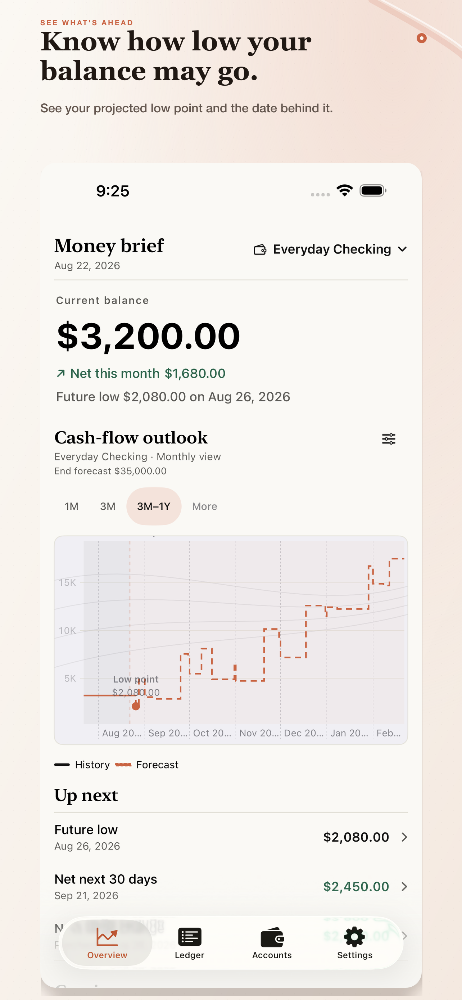
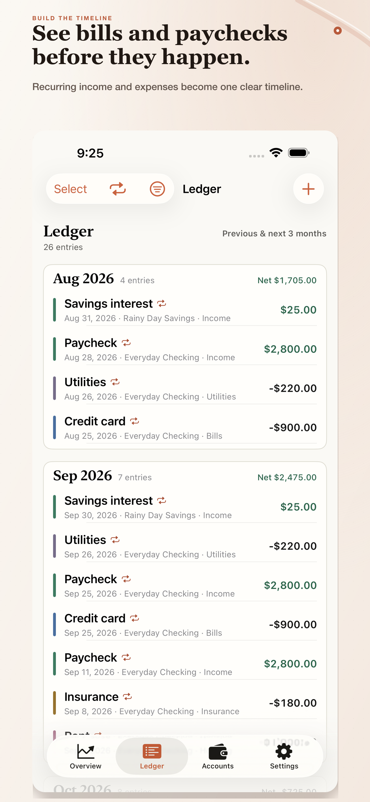
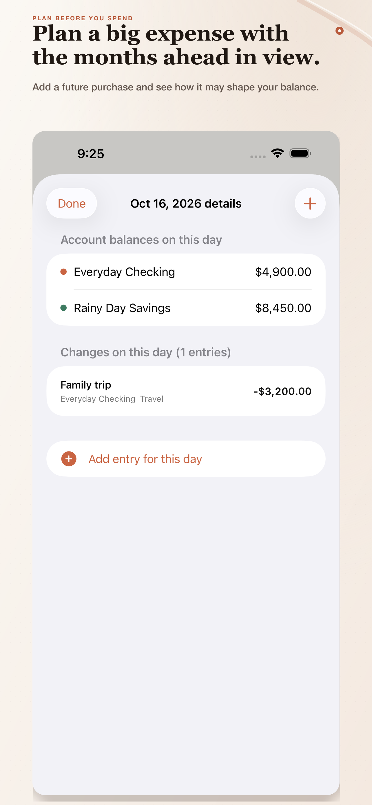
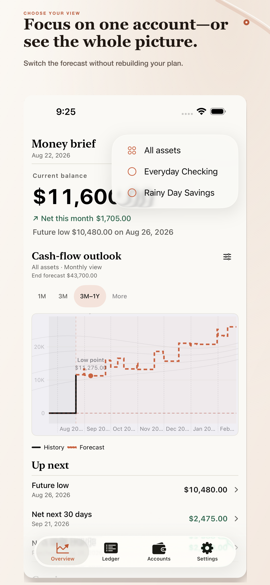
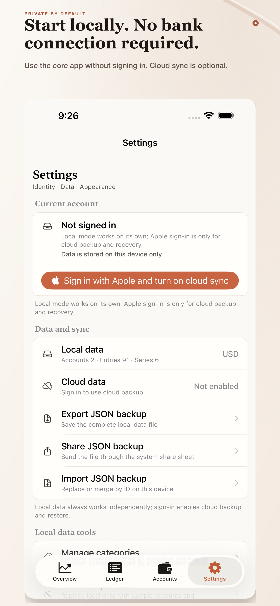
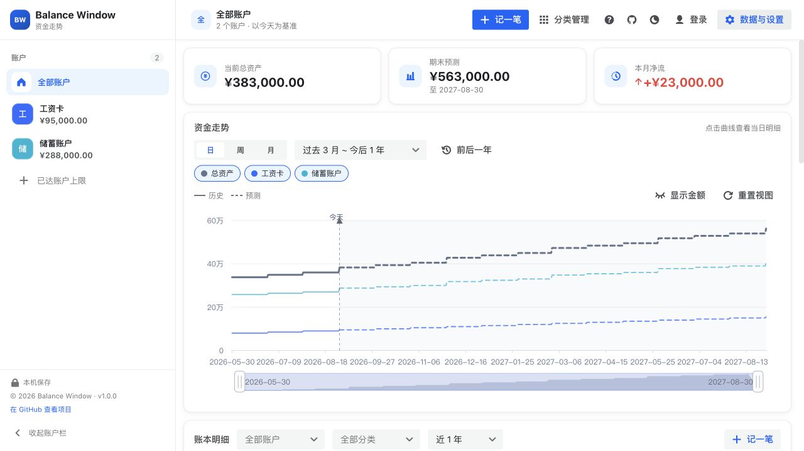

<div align="center">
  <h1>Balance Window</h1>
  <p><strong>See how low your balance might go—before the next bill arrives.</strong></p>
  <p>A local-first cash-flow forecaster for the paychecks, bills, and planned expenses you already know.</p>
  <p>
    <a href="https://apps.apple.com/us/app/balance-window-cash-flow/id6804171868"><strong>View the iOS app</strong></a>
    &nbsp;&nbsp;·&nbsp;&nbsp;
    <a href="https://balancewindow.top/"><strong>Explore the product</strong></a>
    &nbsp;&nbsp;·&nbsp;&nbsp;
    <a href="https://app.balancewindow.top/"><strong>Try the open-source web app</strong></a>
  </p>
  <p><sub>The iOS release is being prepared for the App Store. The web companion is available now.</sub></p>
</div>

<p align="center">
  
  &nbsp;
  
  &nbsp;
  
</p>

<p align="center"><sub>Sample scenarios shown. Balance Window is a planning tool, not a bank balance or financial-advice service.</sub></p>

## Know the answer before money moves

Balance Window is built around one practical question:

> **Based on what I have now and the changes I already know, how low might my balance go—and when?**

| See the low point | Put known changes on one timeline | Test a decision before spending |
| --- | --- | --- |
| Find the projected minimum and the date behind it. | Combine paychecks, rent, cards, utilities, subscriptions, and savings plans. | Add a planned expense and see how it changes the months that follow. |

You enter a small set of meaningful facts. Balance Window turns them into a projected balance, a projected low, and a timeline you can actually act on. It is deliberately not a granular bookkeeping system, bank aggregator, investment tracker, lending product, or accounting platform.

## Choose the experience that fits

| Native iOS — recommended | Open-source web companion |
| --- | --- |
| Designed for quick, everyday check-ins on iPhone. Open the app, see the next low point, and decide whether a known change needs attention. | Built for a larger screen, transparent self-hosting, and local experimentation. Use the hosted version immediately or deploy the source yourself. |
| **[Explore Balance Window for iOS →](https://balancewindow.top/)** | **[Open Balance Window Web →](https://app.balancewindow.top/)** |

The iOS app is the primary product experience. This repository contains the public web companion; the native iOS source, Apple signing material, release configuration, and private operational records are intentionally not included.

## A clearer planning loop

1. **Start with today.** Add the current balance of the few accounts that matter.
2. **Add what you already know.** Enter recurring income, recurring bills, and one-off plans.
3. **Look for the pressure point.** Review the projected curve and its lowest date.
4. **Try the change.** Add or adjust a future expense and compare the result.

<p align="center">
  
  &nbsp;&nbsp;
  
</p>

## The open-source desktop companion

The web app applies the same small-input forecasting model on a desktop-sized workspace. It runs local-first, includes sample data for exploration, and supports optional encrypted cloud sync when configured.

<p align="center">
  <a href="https://app.balancewindow.top/">
    
  </a>
</p>

<p align="center"><sub>Current hosted web interface in a fresh browser session using bundled sample data. No personal financial data is shown.</sub></p>

**[Use the hosted web app](https://app.balancewindow.top/)** · **[Read the web notes](./web/README.md)**

<details>
<summary><strong>Run or deploy the web app yourself</strong></summary>

The public repository is a small npm workspace. A local preview does not require Apple credentials or a bank connection.

```bash
git clone https://github.com/lipeng3g/BalanceWindow.git
cd BalanceWindow
npm install
npm run dev
```

Before publishing a production build:

```bash
npm run type-check
npm test
npm run build
```

The generated `web/dist/` directory can be deployed to Cloudflare Pages. Cloud sync and social sign-in require the corresponding server bindings and secrets; keep those values in the deployment environment and never commit them.

</details>

## Local-first by design

- The web app works locally without requiring an account.
- Cloud sync is optional and must be configured explicitly.
- Exported backups remain under your control.
- No bank connection is required.
- Forecasts are projections based only on the information you enter.

Do not commit Cloudflare secrets, OAuth credentials, Apple private keys, session cookies, or personal financial data. Export a backup before changing or clearing local data.

## Product links

| Destination | Link |
| --- | --- |
| iOS product page | [balancewindow.top](https://balancewindow.top/) |
| App Store listing | [Balance Window: Cash Flow](https://apps.apple.com/us/app/balance-window-cash-flow/id6804171868) |
| Hosted desktop web app | [app.balancewindow.top](https://app.balancewindow.top/) |
| Privacy | [balancewindow.top/privacy](https://balancewindow.top/privacy) |
| Support | [balancewindow.top/support](https://balancewindow.top/support) |

Some Cloudflare deployment identifiers retain the historical `FutureMoney` name for continuity. The current public repository and product brand are **Balance Window**.
